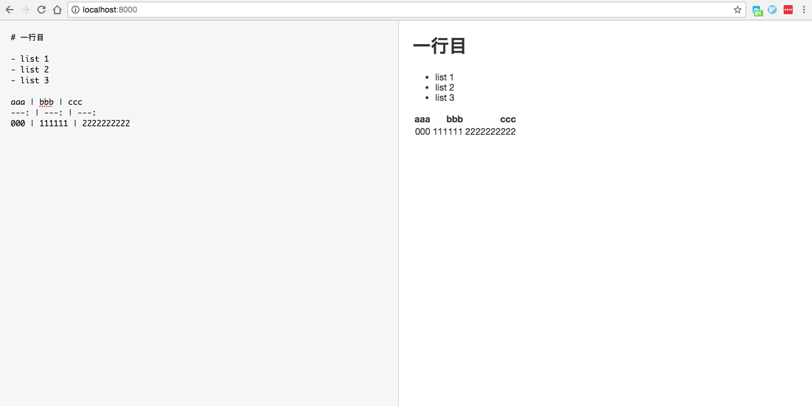

Title: DjangoとVue.jsでMarkdownエディタ
Date: 2017-04-21
Tags: Django, Vue.js
Slug: web/170421django-vue-markdown-editor
Author: one_meets_seven
Summary: DjangoとVue.jsでプレビュー付きのMarkdownエディタ掲示板を作った
Status: published

# DjangoとVue.jsでプレビュー付きのMarkdownエディタ掲示板を作った

Markdown記法が好きです. 簡単なメモには重宝してますし, このブログもMarkdownで書いてます.  
Markdownで記述できる掲示板をつくりたい, 誰もがそう考えたことがあると思います.  
編集中にプレビューしてくれるような機能があるとなお嬉しいです(Qiitaみたいな).  

サーバーサイドはPythonのフレームワークDjango,  
フロントにはJavaScriptのフレームワークVue.jsを用いて  
プレビュー機能をもつシングルページを実装したいと思います.  

## Vue.js
- [Markdown エディタの例 -- Vue.js公式](https://jp.vuejs.org/v2/examples/)  
    - Vue.jsの公式にMarkdownエディタのコードとデモがあります. ありがたい！  
- [体で覚えるVue.js - ディレクティブ編 〜 JSおくのほそ道 #023 -- Qiita @hosomichi](http://qiita.com/hosomichi/items/25041c1d46452de84aa6#v-html)
    - ディレクティブ(HTMLタグに書く`v-`属性)が列挙されています.


### ローカル環境でとりあえず動かしてみる
インストールもせずにCDNで引っ張ります.  
HTML, CSS, JavaScriptが動けばいいので, Pythonのhttp.serverでローカルサーバーを建てます.  

`index.html`
```html
<!DOCTYPE html>
<html>
  <head>
    <meta charset="utf-8">
    <title>Markdown</title>
    <script src="https://cdnjs.cloudflare.com/ajax/libs/lodash.js/4.17.4/lodash.min.js"></script>
    <script src="https://cdnjs.cloudflare.com/ajax/libs/marked/0.3.2/marked.min.js"></script>
    <script src="https://unpkg.com/vue"></script>
    <link rel="stylesheet" href="markdown.css" />
  </head>
  <body>
    <div id="editor">
      <textarea :value="input" @input="update"></textarea>
      <div v-html="compiledMarkdown"></div>
    </div>
    <script src="markdown.js"></script>
  </body>
</html>
```

lodash, marked, そしてVue.jsのCDNを取得してきます.  
肝心の`markdown.js`はサンプル通りに書きます.  

`markdown.js`
```javascript
var editor = new Vue({
  el: '#editor',
  data: {
    input: '# 一行目'
  },
  computed: {
    compiledMarkdown: function () {
      return marked(this.input, { sanitize: true })
    }
  },
  methods: {
    update: _.debounce(function (e) {
      this.input = e.target.value
    }, 300)
  }
})
```

`v-html`はDOM要素の内側をHTMLとして書き換えます.  
例ではcompiledMarkdown関数の戻り値です.  

最後はCSSもサンプル通りに  
`markdown.css`
```css
html, body, #editor {
  margin: 0;
  height: 100%;
  font-family: 'Helvetica Neue', Arial, sans-serif;
  color: #333;
}

textarea, #editor div{
  display: inline-block;
  width: 49%;
  height: 100%;
  vertical-align: top;
  box-sizing: border-box;
  padding: 0 20px;
}

textarea {
  border: none;
  border-right: 1px solid #ccc;
  resize: none;
  outline: none;
  background-color: #f6f6f6;
  font-size: 14px;
  font-family: 'Monaco', courier, monospace;
  padding: 20px;
}

code {
  color: #f66;
}
```

Python2系の場合はSimpleHTTPServer,
3系はhttp.serverでローカルサーバーを立ち上げます.  

```sh
$ python -m SimpleHTTPServer
```

```sh
$ python -m http.server
```

ブラウザで`localhost:8000`を確認してください.  
簡単にマークダウンのプレビュー付きエディタができると思います.  

[](../images/markdown-preview.png)

## Django
- [Django公式Tutorial](https://docs.djangoproject.com/ja/1.11/intro/tutorial01/)
    - Djangoの公式は日本語翻訳もすべてではないですが充実しています. 公式チュートリアルではDjangoの設計方針を理解できます.
- [Python Django入門(1) -- Qiita](http://qiita.com/kaki_k/items/511611cadac1d0c69c54)
    - CRUD(データの作成, 読み込み, 更新, 削除)も丁寧に説明されています.
- [DjangoSnippets](https://djangosnippets.org/)
    - Djangoに関してのSnippets(テクニック)集です.
    - あまり人がいなさそうですが, このサイトの醍醐味はこのサイト自体がコードをGitHubに公開しています.
        - [django/djangosnippets.org -- GitHub](https://github.com/django/djangosnippets.org)


あとは公式サイトのリファレンスが充実しています.  

### DjangoSnippetsを参考にモデル設計
DjangoSnippetsもMarkdown記述するとレンダリングしてくれる掲示板です.  
`app/models.py`はこんな感じになります.  
```python
from .utils import sanitize_markdown

class Post(models.Model):
    title = models.CharField(max_length=255)
    description = models.TextField()
    description_html = models.TextField(editable=False)
    pub_date = models.DateTimeField(auto_now_add=True)
    updated_date = models.DateTimeField(auto_now=True)

    def __str__(self):
        return self.title

    def save(self, *args, **kwargs):
        self.description_html = sanitize_markdown(self.description)
        super(Post, self).save(*args, *kwargs)

    def get_absolute_url(self):
        return reverse('bbs:post_detail', args=[self.id])
```

Markdownで書かれる記事内容の`description`をHTMLに変換し`description_html`に保存する, というデータ構造です.  

`app/utils.py`にある`sanitize_markdown`関数もほぼほぼDjangoSnippetsを真似しました.  

```python
def sanitize_markdown(value):
    return mark_safe(
            bleach.clean(
                markdown_func(value, extensions=['gfm'], tab_length=2),
                tags = [
                    'a', 'abbr', 'acronym', 'b', 'blockquote', 'code', 'em',
                    'h1', 'h2', 'h3', 'h4', 'h5', 'h6',
                    'i', 'li', 'ol', 'p', 'pre', 'strong', 'ul',
                    'table', 'thead', 'tr', 'th', 'tbody', 'td',
                    'div', 'br', 'span',
                ],
            )
    )
```

### Edit

editページのテンプレート. (CSSフレームワークはBootstrap)  
```html
<form class="form-horizontal" role="form" method="post" action="">
  <div class="field error">
    <label for="id_title"></label>
    {{ form.title }}
    <small class="error">{{ form.title.errors|join:", " }}</small>
  </div>
  <div id="editor" class="field error">
    <label for="id_description"></label>
    {{ form.description }}
    <small class="error">{{ form.description.errors|join:", " }}</small>
    <div v-html="compiledMarkdown"></div>
  </div>
  <div class="form-group"><button type="submit" class="btn btn-primary">Save</button></div>
</form>
```

`{{ form.discription }}`の部分が, `<textarea>`タグに変換されるわけです.  
`app/forms.py`は普通こんな感じです.  
```python
class PostForm(forms.ModelForm):
    title = forms.CharField()
    description = forms.CharField(widget=forms.Textarea)

    class Meta:
        model = Post
        fields = ('title', 'description')
```

`forms.Textarea`は`django/forms/widgets/textarea.html`をテンプレとして読み込んでいることがソースからわかります.  
[Textarea -- Widgets | Django documention](https://docs.djangoproject.com/ja/1.11/ref/forms/widgets/#textarea)  

`app/templates/app/textarea.html`という風にテンプレートファイルを作ります.  
```html
<textarea id="{{ widget.name }}" name="{{ widget.name }}"  v-model="input" @input="update">
{{ widget.value }}</textarea>
```

ただ単に, `v-model="input" @input="update"`を挿入したかっただけです.  

`app/forms.py`は以下のように変更できます.  

```python
class EditorTextarea(forms.Textarea):
    template_name = 'app/textarea.html'

    def __init__(self):
        super(EditorTextarea, self).__init__()

class PostForm(forms.ModelForm):
    title = forms.CharField()
    description = forms.CharField(widget=EditorTextarea)

    class Meta:
        model = Post
        fields = ('title', 'description')
```

もともとある記事を編集する場合, さきほどのjsだとinputが毎回初期化され,  
`<text area>`DOMの中身(テキストエリアの中)も消えてしまいます.  
そこで以下のように書き換えます.  

```javascript
var editor = new Vue({
  el: '#editor',
  data: {
    input: null
  },
  created: function(){
    this.input = $('#description').text();
  },
  computed: {
    compiledMarkdown: function () {
      return marked(this.input, { sanitize: true })
    }
  },
  methods: {
    update: _.debounce(function (e) {
      this.input = e.target.value
    }, 300)
  }
})
```

jQueryを使ってDOM要素(そのために`id="description"`を指定しました)をinputに保持させます.  

## 所感
JavaScriptのフレームワークに挑戦みたかったので, Vue.jsを触ってみました.  
React.jsも気になってはいるのですがテンプレートっぽく気軽にかける(いまのところ)Vue.jsのほうが  
敷居が低そうだったので選びました. Markdownエディタのプレビューを実装するにはちょうどよさそうです.  

こんな感じで, ツリー形式のコメントやVote機能をとりつけて, Redditみたいな掲示板を構想しています.  
