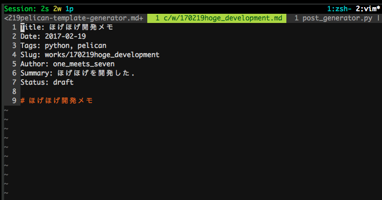

Title: pelicanのMarkdownファイル自動生成ツール
Date: 2017-02-19
Tags: python, CUI
Slug: works/170219pelican-template-generator
Author: one_meets_seven
Summary: Markdownファイルのメタ情報記述の作業をラクにするCUIツールをpythonで開発した
Og_Image: ../images/post_generator.png
Twitter_Image: ../images/post_generator.png

# pelicanの記事半自動生成ツール

- pelicanでブログ記事を生成するときの手間を省けたかった
- 対話式でメタ情報を入力してmdファイルを生成してくれるCUIツール
- pythonで書いた(ていうか``pelican-quickstart``モロパクリした)

## ことのいきさつ
このサイト(静的WebジェネレータPelican製)で新しく記事を書くとき,  
Markdownファイルの先頭に何個か**メタ情報を書く必要**がある.  

```sh
Title: ブログタイトル
Date: 2017-02-19
Tags: python, CUI
Slug: works/170219hoeghoge
Author: one_meets_seven
Summary: 要約

# タイトル
```

(ここでCategoryがないのはプラグインの``category_meta``によるもの。後述)  
このメタ情報を毎回mdファイルを**新規作成するたびに書くのがめんどくさい**.  
Dateとか直書きダサいし超めんどくさい,日付なんだから自動化したい.  
もうちょっと楽しく書きたい.  

せっかくなのでCUIツールをつくって自動化しよう.  

## インスパイア
理想像はすぐに思い浮かんだ.  
pelicanのプロジェクトディレクトリを初めて構築する際の雛形ジェネレータコマンド
[``pelican-quickstart``](https://github.com/getpelican/pelican/blob/master/pelican/tools/pelican_quickstart.py)
だった.  

``pelican-quickstart``
は対話式による標準入力で設定を決めていく感じだった.  
あれならある程度記入必須なタイトルやカテゴリのメタ情報の設定に向いている.  

というわけでソースコードめっちゃパクった.  
askメソッドとか丸写ししたレベル.  


## テンプレート
なにがめんどくさいって``Title:``とか``Date:``とかキー名も毎回いちいち書く必要がある.  
不変だからテンプレート化してしまう.  

``template_post.md.in``
```markdown
Title: $title
Date: $date
Tags: $tags
Slug: $slug
Author: one_meets_seven
Summary: $summary
Status: $status

# $title
```


## ツール使用例
早速だけど使ってみたらこんな感じ.  
(ツール名は``post_generator.py``)

[](../images/post_generator.png)

1. ブログのタイトルを聞かれる.
1. ブログのカテゴリを聞かれる.(この場合は英語記述のほう(次節参照))
1. タグを聞かれる.
1. URLの後ろを聞かれる.(この例だと作成されるブログ記事のURLはworks/170219hoge_development.htmlというURLになる)
1. ブログの要約を聞かれる.
1. 非公開(下書き)か公開か？Yesで``draft``(非公開)状態, Noで``published``(公開)状態となる.

これで``content/works/170219hoge_development.md``というファイルが生成される.  

[](../images/post_generated.png)

メタ情報がテンプレートファイルに埋め込まれて自動生成されている.  


## Categoryについて
PelicanはCategoryを日本語文字で登録すると,  
そのカテゴリのディレクトリ名は意味不明なアルファベットに変換される.  
そこで``category_meta``というプラグインを導入  

例えば  
機械学習という名前のカテゴリ名を作りたい.  
実際に記事作成時に``Category: 機械学習``とすると  
ぐちゃぐちゃなURLのカテゴリ用ページが作られてしまう.  

### URLを``machine_learning``にしてサイトで表示されるカテゴリ名を``機械学習``にする場合  
まずプラグインの使用をONにする.  
``pelicanconf.py``の``PLUGINS``に``category_meta``を追加するだけ.  

```py
# 僕のいまのpelicanconf.py環境です
PLUGIN_PATHS = ['pelican-plugins']
PLUGINS = ['liquid_tags.notebook', 'render_math', 'category_meta']
```

``content``ディレクトリ内に``machine_learning``ディレクトリを作成し,  
``index.md``というファイルを用意する.  

``content/machine_learning/index.md``
```md
Title: 機械学習
Date: 2017-01-01
```

``Date``もないとエラーを吐くので適当に記入  
これで``content/machine_learning``ディレクトリ内に記事を記入していけば  
いい  
はずだが  

実は
```sh
CRITICAL: AttributeError: can't set attribute
```

というエラーがでる.  
GitHubのIssueにも上がってるがバグっぽい  
[https://github.com/getpelican/pelican-plugins/issues/855](https://github.com/getpelican/pelican-plugins/issues/855)  

いまのところpluginのソース``category_meta/category_meta.py``の73行を以下のように変更するしかないっぽい  

```py
    category.slug = slug
```

を,

```py
    category._slug = slug
```

に変更.  
(前アンダースコアを呼び出し。。)  

## まとめ
pelicanの記事用markdownファイルの自動生成CUIツールをつくった.  
作ってから気づいたけどこんなプラグインとか既にありそうだと思った.  

ソースコードです.  
[https://gist.github.com/kazukousen/0423d3681538cf8299a23c1591247bab](https://gist.github.com/kazukousen/0423d3681538cf8299a23c1591247bab)
